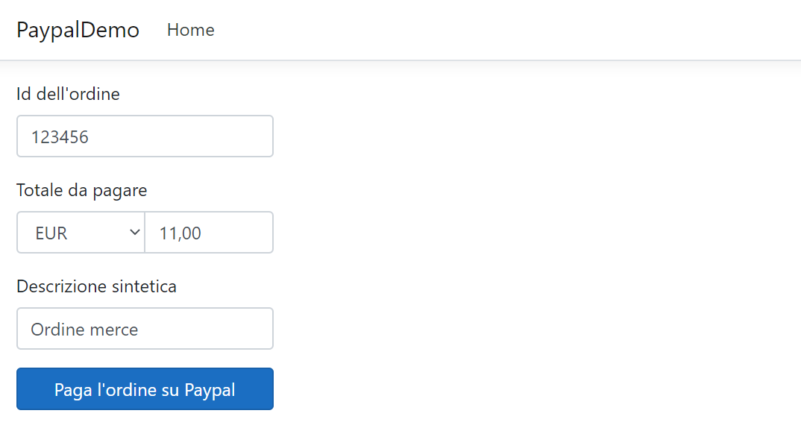

# Esempio di pagamento con Paypal
Questa è un'applicazione ASP.NET Core 3 che dimostra come fare il checkout con Paypal.

## Getting started
 * Per prima cosa, ottieni un Client ID e un Client Secret da Paypal, in modo che tu possa fare i test nella [Sandbox](https://developer.paypal.com/developer/accounts/). 
 https://developer.paypal.com/docs/integration/admin/manage-apps/

 * Ottenuti i due valori, copiali nel file [appsettings.json](appsettings.json) di questo progetto. In alternativa, li puoi impostare in una delle altre fonti di configurazione di ASP.NET Core, come variabili d'ambiente o user secrets.

 * Ora avvia l'applicazione in debug e ti verrà presentato un form per l'immissione dell'ID dell'ordine e dell'importo da transare. In un'applicazione reale queste informazioni devono essere estratte da un database, lì presenti a seguito di un ordine di un'utente. Per nessun motivo l'utente dovrebbe poterle modificare in maniera arbitraria.

## Parti interessanti di quest'applicazione

Questa applicazione usa i pacchetti NuGet  [PayPalCheckoutSdk](https://www.nuget.org/packages/PayPalCheckoutSdk/) e [PaypalHttp](https://www.nuget.org/packages/PayPalHttp/) che sfruttano la [REST API v2 di Paypal](https://developer.paypal.com/docs/api/orders/v2/).

 * Quando si invia il modulo presente in homepage, verrà invocato il metodo `CreateUriForPayment` del servizio [PaypalPaymentService](Models/Services/Application/PaypalPaymentService.cs#L35). Questo metodo si occupa di creare un ordine in Paypal e ottenere l'URL della pagina di pagamento al quale l'utente dovrà essere reindirizzato;

 * Dopo che l'utente ha pagato, verrà reindirizzato indietro alla presente applicazione. A quel punto verrà invocato il metodo `ConfirmOrder` del servizio [PaypalPaymentService](Models/Services/Application/PaypalPaymentService.cs#L83) che si occuperà di finalizzare il pagamento e restituire indietro alcune informazioni, come l'ID della transazione;

 * In caso di errori, verrà scritta una riga di log e verrà poi sollevata un'eccezione che può essere catturata dall'action del controller affinché sia visualizzato un errore significativo per l'utente (questa parte non è inclusa nella demo).